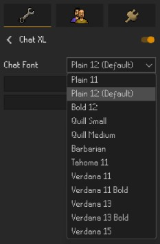
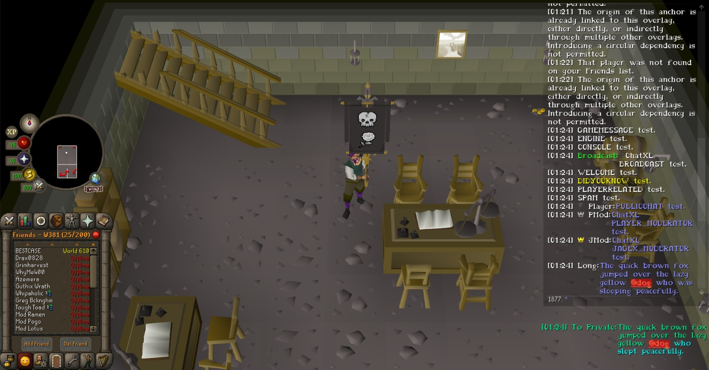
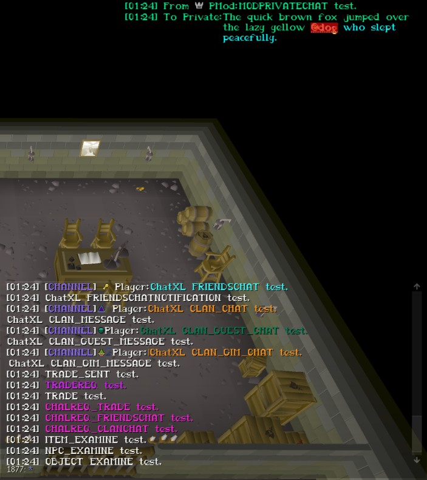

# ChatXL

<b>[</b> A.K.A. BBC — Big Bold Chat <b>]</b>

  

> **ChatXL** is a RuneLite plugin that makes the Old School RuneScape chatbox easier to read by letting you use larger and alternative in-game fonts while keeping the familiar RuneScape chat experience.
>   
> Whether you want bigger text, a bolder font, a resized chatbox, or simply something easier on the eyes, **ChatXL** automatically adjusts chat spacing, wrapping, usernames, icons, message rows, and chatbox presentation to fit your selected settings.

  

---

## Features

- Choose from a variety of built-in RuneScape fonts.
- Makes chat text larger (or smaller) and easier to read.
- Automatically adjusts line spacing and message wrapping.
- Keeps usernames, clan names, ranks, icons, and message text aligned.
- Supports normal and Split Private Chat.
- Supports Public Chat, Friends Chat, Clan Chat, and Guest Clan Chat.
- Supports Game and System messages.
- Includes an integrated resizable chatbox for RuneLite's resizable interface layouts.
- Supports independent chatbox width and height configuration.
- Automatically rewraps retained chat messages when the effective chat width changes.
- Preserves chat presentation while the chatbox interacts with movable RuneLite interface elements.
- Allows Split Private Chat to follow a relocated chatbox.
- Allows Split Private Chat to be moved independently by holding **Alt** and dragging it.
- Supports an inherited or independently configured Split-PM width.
- Includes a hotkey for hiding/showing chat buttons (**Alt+C** by default).
- Includes a hotkey for clearing chat (**Alt+X** by default).
- Clear chat commands are also available with `::clear` and `::cls`.
- Applies font and supported layout changes without requiring a RuneLite restart.
- Designed to preserve the look and feel of the native RuneScape chatbox.

---

## Supported Fonts

ChatXL uses fonts that already exist inside the Old School RuneScape client.

  

Available fonts include:

- **Plain 11**
- **Plain 12** — Default
- **Bold 12**
- **Quill Small**
- **Quill Medium**
- **Barbarian**
- **Tahoma 11**
- **Verdana 11**
- **Verdana 11 Bold**
- **Verdana 13**
- **Verdana 13 Bold**
- **Verdana 15**

Each font is individually adjusted so that chat remains readable and properly aligned.

  

  

  

---

## Supported Chat Types

ChatXL is designed to work throughout the RuneScape chatbox, including:

- Public Chat
- Private Messages
- Split Private Chat
- Friends Chat
- Clan Chat
- Guest Clan Chat
- Game Messages
- System Messages
- Chat-channel notices and notifications
- Common Clan and Guest Clan notifications

ChatXL also preserves the icons and labels normally shown alongside messages, including clan ranks and account/build icons where applicable.

  

---

## Resizable Chatbox

ChatXL includes an integrated chatbox resizer for RuneLite's resizable interface layouts.

You can configure the chatbox width and height directly from ChatXL while retaining native-style message presentation. When the effective chat width changes, retained chat rows are reconstructed so wrapped messages continue to fit the available space.

ChatXL also accounts for movable RuneLite interface elements when determining the effective chatbox area, helping the chatbox remain usable when other interface elements overlap its normal space.

  

---

## Split Private Chat

Split Private Chat is integrated with ChatXL's resized and relocated chatbox behavior.

By default, Split-PM follows the relocated chatbox. You can also hold **Alt** and drag the Split-PM area to place it independently, using RuneLite's normal movable-overlay behavior.

Split-PM width follows the chatbox width until it is manually overridden. Once a separate Split-PM width is configured, it remains independent until the setting is reset.

Wrapped Split-PM messages also retain correct sender/prefix alignment with ChatXL fonts.

  

---

## Installation

ChatXL is designed to be installed directly through the **RuneLite Plugin Hub**.

1. Open RuneLite.
2. Open the **Plugin Configuration** panel.
3. Select **Plugin Hub**.
4. Search for **ChatXL**.
5. Install and enable the plugin.
6. Open the **ChatXL** settings and choose your preferred font and chatbox settings.

## Configurations

After installing the plugin:

1. Open the **ChatXL** configuration panel.
2. Select the font you want to use.
3. Configure your preferred chatbox width and height.
4. Configure Split-PM width if you want it to differ from the chatbox width.
5. Adjust the hide/show and clear-chat hotkeys if desired.
6. Your visible chat messages will refresh automatically as supported settings change.

There is no need to restart RuneLite when changing fonts or supported ChatXL presentation settings.

  

---

## Hotkeys & Chat Controls

ChatXL includes convenient controls for common chatbox actions:

- **Alt+C** — Hide/show the chat buttons by default.
- **Alt+X** — Clear the chat history by default.
- `::clear` — Clear the chat history.
- `::cls` — Clear the chat history.

Both hotkeys can be changed from the ChatXL configuration panel.

---

## Why ChatXL?

RuneScape's default chat font and chatbox size can be difficult to read on larger displays, high-resolution monitors, or from farther away.

ChatXL is intended for players who want:

- Larger chat text without replacing the native chatbox.
- A larger or differently sized chatbox while keeping RuneScape's familiar presentation.
- More readable fonts for longer play sessions.
- A choice of RuneScape-style fonts rather than external desktop fonts.
- Consistent formatting across the different RuneScape chat channels.
- Better control over Split Private Chat placement and width.
- Convenient chat controls without replacing RuneLite's normal interface behavior.
- Better readability while keeping the game interface familiar.

## Coming Soon

<b>V2.7</b>: Additional resizable-interface integration and collision handling 
<b>V2.8</b>: Resize UX polish 
<b>V2.9</b>: Accessibility and player-facing improvements 
<b>V3.0</b>: Further resizable interface integrations (Inventory, Minimap, et cetera) 

---

### Feedback

If something does not look right, please open a GitHub issue and include:

- The ChatXL font you were using.
- The affected chat type.
- A screenshot showing the full affected message or chat row.
- A short description of what happened.
- Steps to reproduce it, if known.

For layout issues, a screenshot showing the surrounding chatbox and nearby movable interface elements is especially helpful.

  

- <b>NOTE:</b> Verdana 13 Bold <u><i>purposefully</i></u> replaces malformed colons (":") with hyphens ("-") due to a Jagex glyph-rendering issue.

---

### Disclaimer

ChatXL is a third-party RuneLite plugin and is not affiliated with, endorsed by, or sponsored by Jagex Ltd. or the RuneLite project.

Old School RuneScape and RuneScape are trademarks of Jagex Ltd.
