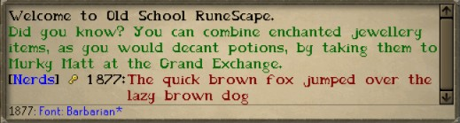
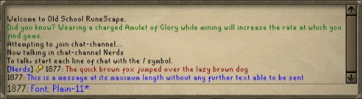
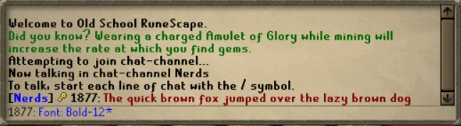
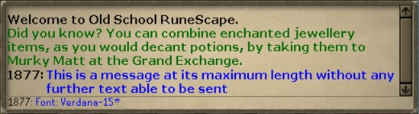
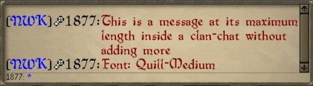
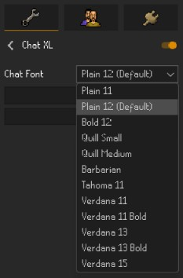
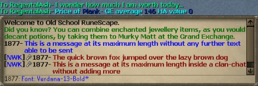

# ChatXL

<b>[</b> A.K.A. BBC — Big Bold Chat <b>]</b>

  

> **ChatXL** is a RuneLite plugin that makes the Old School RuneScape chatbox easier to read by letting you use larger and alternative in-game fonts while keeping the familiar RuneScape chat experience.
>   
> Whether you want bigger text, a bolder font, or simply something easier on the eyes, **ChatXL** automatically adjusts chat spacing, wrapping, usernames, icons, and message rows to fit your selected font.

  

---

## Features

- Choose from a variety of built-in RuneScape fonts.
- Makes chat text larger (or smaller) and easier to read.
- Automatically adjusts line spacing and message wrapping.
- Keeps usernames, clan names, ranks, and message text aligned.
- Supports normal and Split Private Chat.
- Supports Public Chat, Friends Chat, Clan Chat, and Guest Clan Chat.
- Supports Game and System messages.
- Works with RuneLite's resizable interface layouts.
- Designed to preserve the look and feel of the native RuneScape chatbox.
- Applies font changes immediately when you change your ChatXL settings.

---

## Supported Fonts

ChatXL uses fonts that already exist inside the Old School RuneScape client.

Available fonts include:

- **Plain 11**
- **Plain 12** — Default
- **Bold 12**
- **Quill Small**
- **Quill Medium**
- **Barbarian**
- **Tahoma 11**
- **Verdana 11**
- **Verdana 11 Bold**
- **Verdana 13**
- **Verdana 13 Bold**
- **Verdana 15**

Each font is individually adjusted so that chat remains readable and properly aligned.

  

  

  

---

## Supported Chat Types

ChatXL is designed to work throughout the RuneScape chatbox, including:

- Public Chat
- Private Messages
- Split Private Chat
- Friends Chat
- Clan Chat
- Guest Clan Chat
- Game Messages
- System Messages
- Chat-channel notices and notifications
- Common Clan and Guest Clan notifications

ChatXL also preserves the icons and labels normally shown alongside messages, including clan ranks and account/build icons where applicable.

  

---

## Installation

ChatXL is designed to be installed directly through the **RuneLite Plugin Hub**.

1. Open RuneLite.
2. Open the **Plugin Configuration** panel.
3. Select **Plugin Hub**.
4. Search for **ChatXL**.
5. Install and enable the plugin.
6. Open the **ChatXL** settings and choose your preferred font.

## Configurations

After installing the plugin:

1. Open the **ChatXL** configuration panel.
2. Select the font you want to use.
3. Your visible chat messages will refresh automatically.
4. Try different fonts until you find the size and style that is most comfortable for you.

There is no need to restart RuneLite when changing fonts.

  

---

## Why ChatXL?

RuneScape's default chat font can be difficult to read on larger displays, high-resolution monitors, or from farther away.

ChatXL is intended for players who want:

- Larger chat text without replacing the native chatbox.
- More readable fonts for longer play sessions.
- A choice of RuneScape-style fonts rather than external desktop fonts.
- Consistent formatting across the different RuneScape chat channels.
- Better readability while keeping the game interface familiar.

## Coming Soon

<b>V2</b>: Integrated Resizeable Chatbox

---

### Feedback

If something does not look right, please open a GitHub issue and include:

- The ChatXL font you were using.
- The affected chat type.
- A screenshot showing the full affected message or chat row.
- A short description of what happened.
- Steps to reproduce it, if known.

For layout issues, a screenshot showing the surrounding chatbox is especially helpful.

  

- <b>NOTE:</b> Verdana 13 Bold <u><i>purposefully</i></u> replaces malformed colons (":") with hyphens ("-") due to a Jagex glyph-rendering issue.

---

### Disclaimer

ChatXL is a third-party RuneLite plugin and is not affiliated with, endorsed by, or sponsored by Jagex Ltd. or the RuneLite project.

Old School RuneScape and RuneScape are trademarks of Jagex Ltd.
